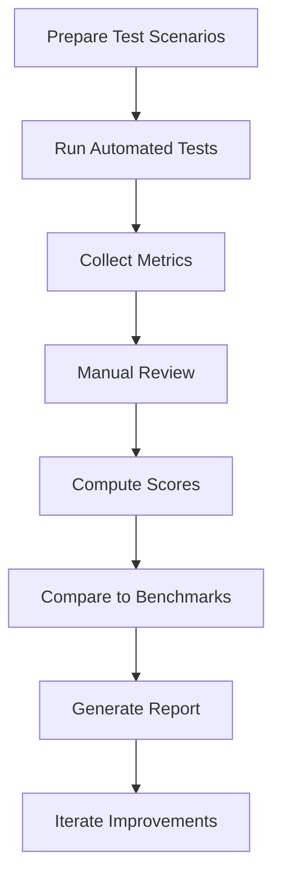

# AI Evaluation Framework for DealForge AI

## Introduction

This framework is designed to evaluate the DealForge AI system after implementing recommended improvements, such as real MCP integration, enhanced tools, and a dedicated report agent. It focuses on key areas: agent performance, workflow efficiency, output quality, and alignment with Private Equity (PE) and McKinsey/Bain/BCG (MBB) standards. The framework draws from previous analyses noting partial replication due to stubbed MCP and minimal tools, moderate output quality with parsing/API issues, and assumes these have been addressed.

Benchmarks are incorporated for accuracy, completeness, tool usage, collaboration, and error handling to ensure comprehensive assessment.

## Evaluation Categories and Metrics

### 1. Agent Performance
Assesses individual agent effectiveness across various types (e.g., financial_analyst, legal_advisor, risk_assessor).

- **Accuracy**: Percentage of outputs matching ground truth or expert benchmarks.
- **Completeness**: Proportion of required elements covered in the analysis.
- **Tool Usage**: Number of appropriate tool calls vs. total calls; efficiency in selecting tools.
- **Error Handling**: Rate of successful error detection and recovery.
- **Collaboration**: Quality of interactions with other agents (e.g., information sharing, conflict resolution).

### 2. Workflow Efficiency
Evaluates the overall system workflow, including multi-agent orchestration.

- **Time to Completion**: Average duration from input to final output.
- **Resource Utilization**: CPU, memory, and API call usage.
- **Iteration Count**: Number of cycles needed for convergence.
- **Scalability**: Performance under increased load or complexity.

### 3. Output Quality
Focuses on the final deliverables, such as reports and recommendations.

- **Clarity and Structure**: Readability, logical flow, and professional formatting.
- **Relevance**: Alignment with user query and deal context.
- **Depth and Insight**: Level of analysis beyond surface-level data.
- **Consistency**: Uniformity across different runs or agents.

### 4. Alignment with PE/MBB Standards
Ensures outputs meet professional standards in private equity and top consulting firms.

- **Financial Modeling Accuracy**: Adherence to best practices in DCF, LBO, etc.
- **Due Diligence Thoroughness**: Comprehensive coverage of risks, market analysis.
- **Report Quality**: Matches IC memo formats, with executive summaries, data visualizations.
- **Ethical Considerations**: Handling of biases, compliance with regulations.

## Benchmarks
Benchmarks provide quantitative targets, assuming post-improvement system:

- Accuracy: >90% match with expert evaluations.
- Completeness: >95% coverage of checklist items.
- Tool Usage Efficiency: >80% appropriate calls; <10% redundant usage.
- Error Handling: >85% recovery rate.
- Time to Completion: <5 minutes for simple workflows, <30 minutes for complex.
- Collaboration Score: >4/5 based on expert review.
- Output Quality: >4/5 on rubric scale.
- PE/MBB Alignment: 100% adherence to core standards (e.g., no factual errors in models).

## Test Scenarios
Detailed scenarios tailored to different agent types, deal complexities, and improvement areas. Each scenario includes input data, expected outputs, and success criteria.

- **Scenario 1: Financial Modeling for Tech Startup** (Tests financial_analyst, dcf_lbo_architect)
  - Input: Company financials, market data.
  - Focus: Accuracy in DCF/LBO models, tool usage (e.g., finance_toolkit).
  - Complexity: Medium; include API parsing test.

- **Scenario 2: Legal Due Diligence for Merger** (Tests legal_advisor, compliance_qa_agent)
  - Input: Contract documents, regulatory filings.
  - Focus: Completeness in risk identification, alignment with PE standards.
  - Complexity: High; test error handling with incomplete data.

- **Scenario 3: Market Research and Risk Assessment** (Tests market_researcher, risk_assessor)
  - Input: Industry reports, competitor data.
  - Focus: Depth of insights, collaboration with other agents.
  - Complexity: Low; test workflow efficiency.

- **Scenario 4: Full Deal Workflow with MCP** (Tests ofas_supervisor, multiple agents)
  - Input: Complete deal prospectus.
  - Focus: End-to-end efficiency, output quality, real MCP usage.
  - Complexity: High; include collaboration and error handling.

- **Scenario 5: Report Generation** (Tests investment_memo_agent, report_generator)
  - Input: Analyzed data from prior agents.
  - Focus: Output quality, PE/MBB formatting.
  - Complexity: Medium; test post-improvement report agent.

Additional scenarios for edge cases: invalid inputs, high-load conditions, cross-sector deals (e.g., tech vs. energy).

## Evaluation Methods
- **Automated Testing**: Use scripts (e.g., pytest integrations) to run scenarios, compute metrics like accuracy via similarity scores (e.g., BLEU for text, numerical diffs for models).
- **Manual Review**: Expert evaluators (PE/MBB professionals) score outputs using rubrics (1-5 scale).
- **Hybrid Approach**: Automated pre-screening followed by manual validation for qualitative aspects.
- **Tools Integration**: Leverage system's own scoring engine for self-assessment, compare with ground truth.
- **Logging and Analysis**: Capture logs for tool usage, errors; analyze with tools like search_files for patterns.

## Evaluation Workflow Diagram

This framework provides a comprehensive, structured approach to evaluating DealForge AI, ensuring it meets high standards post-improvements.