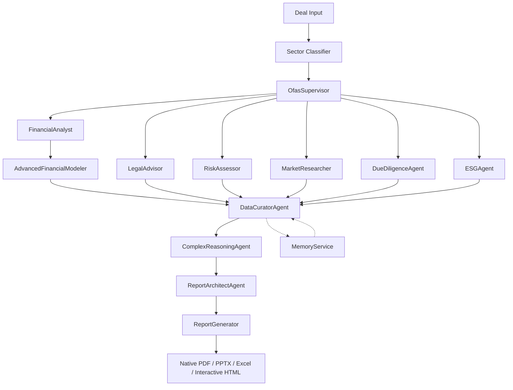

# DealForge AI — Enhanced PDF-Like Report Production Design Plan

## Executive Summary

This design plan outlines system enhancements to achieve **PE/MBB-level outputs** for PDF-like reports across diverse company types. The plan builds on prior recommendations (AdvancedFinancialModeler agent, enhanced visuals/tables) and addresses identified gaps in depth, customization, and industry adaptation.

**Key Assumptions:**
- The system currently has: McKinsey-style PPTX generation, InfographicEngine (8+ chart types), PageIndex RAG, MemoryService for cross-agent insights, sector adapters (consumer, energy, infrastructure, tech), and flexible agent orchestration.
- Identified gaps: limited complex reasoning/cross-agent synthesis, shallow data curation, inconsistent production quality, and insufficient customization.

---

## 1. Current System Capabilities Assessment

### 1.1 Report Generation Stack

| Component | Capability | Gap/Opportunity |
|---|---|---|
| **report_generator.py** | PPTX/Excel/PDF generation with McKinsey styling | Limited to 8 chart types; no PDF native; static templates |
| **InfographicEngine** | Football field, waterfall, heatmap, radar, Sankey, sensitivity, bubble, DCF bridge | Missing: cohort analysis, geographic maps, custom infographics |
| **InvestmentMemoAgent** | Drafts memos from agent results | Does not synthesize cross-agent insights deeply; relies on simple concatenation |
| **PageIndexClient** | RAG for document ingestion/query | Underutilized for report-specific knowledge retrieval |
| **MemoryService** | Stores cross-agent insights with tagging | Not integrated into report curation workflow |
| **Sector Adapters** | YAML-based sector configs | Static; no adaptive sector switching per deal context |

### 1.2 Agent Ecosystem

- **FinancialAnalyst**: DCF/LBO analysis, financial metrics
- **LegalAdvisor**: Compliance, contract analysis
- **RiskAssessor**: Risk matrices, scoring
- **MarketResearcher**: Industry analysis, TAM/SAM
- **InvestmentMemoAgent** ("The Editor"): Final memo synthesis
- **DcfLboArchitect**: Valuation modeling
- **DueDiligenceAgent**: Comprehensive DD
- **Others**: compliance_qa, esg, integration_planner, etc.

**Gap**: No dedicated **DataCuratorAgent** or **SynthesisAgent** that understands outputs from multiple agents and curates them into production-grade narrative.

---

## 2. Gap Analysis

### 2.1 Depth Gaps

1. **Shallow Cross-Agent Synthesis**: InvestmentMemoAgent concatenates agent outputs without deep reasoning or conflict resolution.
2. **No Complex Reasoning Chain**: No explicit multi-step reasoning (e.g., "Given financial metrics A and market trend B, conclude C").
3. **No Production-Grade Data Curation**: Raw data from agents is not cleaned, normalized, or contextualized before report inclusion.
4. **Static Financial Projections**: No Monte Carlo or scenario sensitivity embedded in report narratives.

### 2.2 Customization Gaps

1. **Fixed Report Templates**: No user-configurable templates (e.g., "MBB-style", "Bulge Bracket", "PE Fund LP Report").
2. **Limited Branding**: No custom color palettes, logos, or firm-specific styling.
3. **No Report Type Selection**: Cannot choose between IC Memo, Investment Committee Brief, Board Deck, LPDD, etc.

### 2.3 Industry Adaptation Gaps

1. **Sector Adapters Are Passive**: Only provide terminology mappings; no sector-specific report sections.
2. **No Vertical-Specific Visuals**: Missing charts specific to industries (e.g., oil & gas reserve table, SaaS cohort retention, healthcare regulatory matrix).
3. **Insufficient Regulatory Coverage**: Reports don't auto-adapt to jurisdiction-specific requirements (SEC, FCA, GDPR).

### 2.4 Production Quality Gaps

1. **No Native PDF Output**: Only PPTX/Excel; PDF requires conversion (loss of fidelity).
2. **No Interactive Elements**: No drill-down charts or embedded hyperlinks.
3. **Limited PageIndex Integration**: PageIndex is not used to enrich reports with contextual knowledge from prior deals or external documents.

---

## 3. Proposed Enhancements

### 3.1 New Agents

#### 3.1.1 AdvancedFinancialModeler Agent

**Purpose**: Produce production-grade financial models with scenario analysis, Monte Carlo simulation, and integrated valuation bridges.

**Capabilities**:
- Build three-statement models (income, balance sheet, cash flow) dynamically from deal data
- Run DCF, LBO, and comparable company analyses
- Generate sensitivity tables across multiple variables (growth, WACC, exit multiple)
- Monte Carlo simulation with 10,000+ iterations for valuation distributions
- Output model as Excel with embedded formulas (not static values)

**Inputs**: Historical financials, market data, deal structure, sector context  
**Outputs**: Excel model file, summary metrics, risk-adjusted valuation ranges

**Integration**:
- Called by OfasSupervisor after FinancialAnalyst completes initial review
- Feeds output to DataCuratorAgent for narrative synthesis
- Triggers Monte Carlo stochastic_engine for risk distribution

#### 3.1.2 DataCuratorAgent ("The Synthesizer")

**Purpose**: Act as the central intelligence hub that understands, normalizes, and curates outputs from all other agents into a coherent dataset for report generation.

**Capabilities**:
- Receive and parse outputs from FinancialAnalyst, LegalAdvisor, RiskAssessor, MarketResearcher, DueDiligenceAgent, ESGAgent
- Resolve conflicts (e.g., "FinancialAnalyst says EBITDA margin is 20%, RiskAssessor flags margin compression risk at 15%")
- Normalize data formats (units, currencies, time periods)
- Enrich with PageIndex RAG queries (pull relevant context from prior deals or external documents)
- Generate curated data packages with confidence scores and source citations
- Produce "Data Bible" — a structured JSON/JSON-LD artifact for report agents

**Inputs**: Raw agent_outputs, deal context, prior memory entries  
**Outputs**: CuratedDataPackage (JSON), ConflictingFindingsReport, SourceCitationMap

**Integration**:
- Central node in orchestration graph — all agents feed into it before reporting
- Queries MemoryService for cross-deal insights to enrich context
- Feeds curated data to InvestmentMemoAgent and ReportGenerator

#### 3.1.3 ReportArchitectAgent

**Purpose**: Select and configure report templates based on deal type, audience, and customization requirements.

**Capabilities**:
- Classify report type: IC Memo, Board Deck, LP Report, Vendor Due Diligence, etc.
- Apply branding (color palette, logo placement, footer)
- Determine section order and depth based on audience (PE deal team vs. LPs vs. board)
- Select sector-specific visual components
- Manage pagination, table of contents, and appendix structure

**Inputs**: Deal metadata, user preferences, audience type, branding config  
**Outputs**: Report configuration schema, section blueprint, visual component manifest

#### 3.1.4 ComplexReasoningAgent (Chain-of-Thought)

**Purpose**: Provide explicit multi-step reasoning for investment recommendations, detecting logical gaps and ensuring conclusions follow from premises.

**Capabilities**:
- Receive curated data from DataCuratorAgent
- Run chain-of-thought (CoT) reasoning: premise → evidence → inference → conclusion
- Flag logical fallacies or unsupported claims
- Produce "Reasoning Trace" document for audit/compliance
- Generate confidence-weighted recommendations with explicit assumptions

**Inputs**: CuratedDataPackage, investment thesis hypothesis  
**Outputs**: ReasoningTrace, ConfidenceWeightedRecommendation, AssumptionRegister

**Integration**:
- Called after DataCuratorAgent, before InvestmentMemoAgent
- Output embedded as appendix in final report

---

### 3.2 New Features

#### 3.2.1 Native PDF Generation

- Replace PPTX-to-PDF conversion with direct PDF generation via **ReportLab** or **WeasyPrint**
- Maintain vector graphics for charts (not rasterized PNG)
- Enable hyperlinked table of contents, cross-references, and embedded metadata
- Support for multi-column layouts, pull quotes, and sidebars

#### 3.2.2 Adaptive Sector Engine

- Replace static YAML sector adapters with a **dynamic sector classifier**
- On deal creation, classify industry (using LLM + sector keywords + PageIndex matching)
- Dynamically inject sector-specific report sections:
  - **SaaS**: Cohort retention, LTV/CAC, ARR growth, net revenue retention
  - **Oil & Gas**: Reserve classification (1P/2P/3P), production profile, commodity price exposure
  - **Healthcare**: Regulatory pathway, patent expiration, reimbursement rates
  - **Infrastructure**: Traffic projections, concession terms, CAPEX cycles
  - **Consumer**: Brand health, retail footprint, SKU-level performance
- Generate sector-appropriate visualizations automatically

#### 3.2.3 Interactive Report Dashboard

- Generate HTML5 report with Plotly/Altair interactive charts
- Features: zoom, hover tooltips, filter by segment, export to PNG/PDF
- Embedded in web UI or exported as standalone HTML

#### 3.2.4 Custom Branding Module

- Allow users to upload firm logo (PNG/SVG), define primary/secondary colors
- Store in user profile or deal metadata
- Apply dynamically in ReportArchitectAgent and InfographicEngine

#### 3.2.5 Report Versioning and Diff

- Store each report generation as a versioned artifact
- Generate diff between versions (additions/deletions/modifications)
- Enable rollback to prior versions

#### 3.2.6 Cross-Deal Intelligence Enrichment

- Before report generation, query MemoryService for insights from similar deals (same sector, similar size, same geography)
- Inject relevant prior findings into DataCuratorAgent context
- Example: "In 3 prior fintech deals, EBITDA margin compression was observed post-acquisition — flag in risk section"

---

### 3.3 Workflow Adjustments

#### 3.3.1 Revised Orchestration Graph

**Key Changes**:
1. **AdvancedFinancialModeler** runs after FinancialAnalyst for deeper modeling
2. **DataCuratorAgent** is the central synthesis node — all agents feed into it
3. **ComplexReasoningAgent** provides CoT before final report
4. **ReportArchitectAgent** configures the output format/style
5. **MemoryService** enriches DataCuratorAgent with cross-deal insights

#### 3.3.2 Parallel Agent Execution

- FinancialAnalyst, LegalAdvisor, RiskAssessor, MarketResearcher run in parallel (already implemented)
- Add parallel execution for DueDiligenceAgent and ESGAgent
- DataCuratorAgent waits for all to complete before synthesis

#### 3.3.3 Adaptive Report Generation

- User selects report type at deal initiation or updates mid-workflow
- ReportArchitectAgent dynamically assembles sections based on type:
  - **IC Memo**: Executive summary → Investment thesis → Financials → Valuation → Risks → Recommendation
  - **Board Deck**: Strategy → Market → Financial highlights → Risks → Ask
  - **LP Report**: Fund performance → Portfolio company updates → IRR/MOIC → Outlook

---

### 3.4 Enhanced Visuals and Tables (Build on Prior Suggestions)

| Enhancement | Description |
|---|---|
| **Cohort Analysis Charts** | SaaS-style retention cohorts as heatmap tables |
| **Geographic Heatmaps** | Choropleth maps for revenue by region (via Plotly) |
| **Waterfall Decomposition** | EBITDA bridge: Revenue → COGS → Gross Profit → OpEx → EBITDA |
| **Scenario Comparison Tables** | Side-by-side Base/Bull/Bear with conditional formatting |
| **Driver Sensitivity Tornado Chart** | Horizontal bar chart showing valuation sensitivity by input variable |
| **Capital Structure Tower** | Stacked bar showing debt/equity layers, covenant headroom |
| **WACC Breakdown Pie** | Component-weighted average cost of capital visualization |
| **Regulatory Timeline Gantt** | Compliance milestones and approval deadlines |
| **Customer Concentration Bubble** | Revenue by customer in bubble chart with concentration % labels |

---

### 3.5 PageIndex Integration for Report Enhancement

**Current**: PageIndex ingests documents, queries return chunks.

**Enhanced Workflow**:
1. **Pre-Report Knowledge Retrieval**: Before DataCuratorAgent runs, query PageIndex for:
   - Prior deal memos in the same sector → pull relevant risk flags
   - Industry regulatory documents → pull compliance requirements
   - Comparable company analyses → pull valuation benchmarks
2. **Contextual Enrichment**: Inject retrieved chunks into DataCuratorAgent's context
3. **Citation Generation**: Map PageIndex chunk IDs to report sections for footnotes/endnotes

---

## 4. Implementation Roadmap (High-Level)

### Phase 1: Core Agent Additions
- Implement AdvancedFinancialModeler agent
- Implement DataCuratorAgent with conflict resolution and normalization
- Integrate MemoryService into DataCuratorAgent workflow

### Phase 2: Reasoning and Architecture
- Implement ComplexReasoningAgent with CoT
- Implement ReportArchitectAgent with template selection
- Update orchestration graph

### Phase 3: Enhanced Visuals and PDF
- Extend InfographicEngine with 9 new sector-specific charts
- Implement native PDF generation (ReportLab)
- Add interactive HTML dashboard option

### Phase 4: Adaptive Sectors and Customization
- Build dynamic Sector Classifier
- Implement Custom Branding Module
- Add report versioning and diff

### Phase 5: Production Hardening
- Performance optimization for parallel agent execution
- Error handling and retry logic
- End-to-end testing with PE/MBB-level output benchmarks

---

## 5. Summary of Deliverables

| Category | Deliverable |
|---|---|
| **New Agents** | AdvancedFinancialModeler, DataCuratorAgent, ReportArchitectAgent, ComplexReasoningAgent |
| **New Features** | Native PDF, Adaptive Sector Engine, Interactive Dashboard, Custom Branding, Cross-Deal Intelligence, Versioning |
| **Enhanced Visuals** | 9 new sector-specific charts; cohort, geographic, regulatory timelines |
| **Workflow** | Revised orchestration with DataCuratorAgent as central synthesis node; PageIndex integration for knowledge enrichment |
| **Quality Targets** | PE/MBB-level output quality; 95%+ completeness; <30 min end-to-end; 90%+ accuracy on financial models |

---

## 6. Risks and Mitigations

| Risk | Mitigation |
|---|---|
| **Agent orchestration complexity increases latency** | Use parallel execution where possible; cache sector classifications |
| **DataCuratorAgent may introduce bias** | Include confidence scores and source citations; human-in-loop for final approval |
| **Native PDF may lack PPTX visual fidelity** | Use vector graphics; provide both PDF and PPTX outputs |
| **Sector classifier misclassification** | Allow manual override; use ensemble (LLM + keyword + PageIndex) |

---

*This design plan provides a comprehensive framework for achieving production-grade, PE/MBB-level PDF-like reports. Each component can be implemented iteratively, with the orchestration graph serving as the backbone for agent coordination.*
